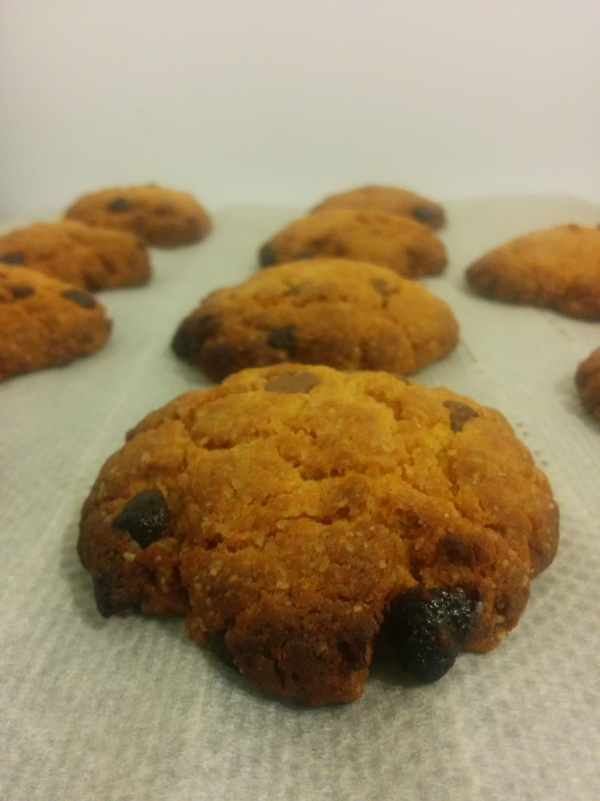

# American cookie

## Ingrédients

- 250 de farine
- 90 g de sucre de canne roux
- 1 sachet de sucre vanillé
- 1 pincée de sel
- 1/2 sachet de levure
- 1 oeuf
- 125 g de beurre doux
- 2 cuillières à café de miel
- des pépites de chocolat (au lait)

## Etapes

- Préchauffer le four à 220°X (thermostat 7-8), avec la grille au plus bas.
- Mélanger la farine, les sucres, le set et la levure dans un grand saladier
- Faites fondre le beurre et ajoutez-y l'oeuf battu et les 2 cuillères de miel, puis incorporez le tout à la préparation
- Ajouter les pépites de chocolat, mélanger
- Façonner des cookires d'env. 10cm de diamètre
- Enfourner 9 à 11 minutes
