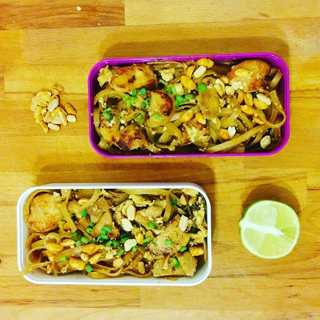

# Pad-Thaï

## Ingrédients

Pour 4 personnes

- 285g de vermicelles de riz
- 12cl de sauce soja
- 2 cuillières à soupe d'huile d'olive
- 350g d'escalopes de poulet émincé
- 180g de tofu ferme coupé en lamelles
- 3 gousses d'ail hachées
- 3 oeufs
- 3 à 4 oignons verts hachés
- 100g de cacahuètes grillés
- 150g de germes de soja
- 1 citron vert coupé en quartiers

## Etapes

- Tremper les nouilles de riz dans de l'eau chaude pendant 20 minutes
- Dans un ramequin, mélanger la sauce soja, le sucre roux et l'huile
- Faire revenir les morceaux de poulet et de tofu dans un wok sur feu moyen-vif
- Ajouter l'ail et le contenu du ramequin. Laisser cuire 2 min puis ajouter les nouilles
- Laisser cuire jusqu'à que les nouilles soient tendres
- Pousser les nouilles sur le côté, casser les trois oeufs sur le côté et mélanger les oeufs jusqu'à qu'ils deviennent fermes
- Mélanger le tout
- Servir sur un plat/une assiette en ajoutant sur le dessus les cacahuètes grillées, les pousses de suja et le quartier de citron
