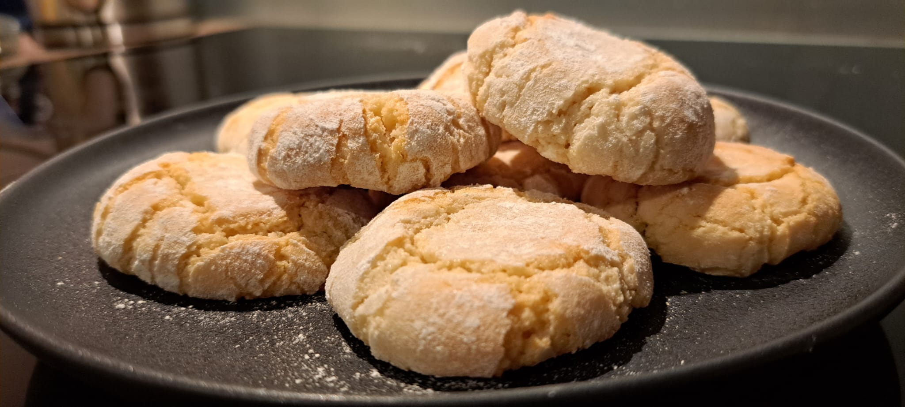

# Amaretti

## Ingredients

- exactly 60 grams of egg whites (about 2 egg whites)
- 180 grams of ground almonds
- 50 grams of flour
- 2 teaspoons of bitter almond extract
- 1 pinch of salt
- 150 grams of caster sugar
- Icing sugar for the coating, about 30 grams

> Tests in progress to reduce the amount of sugar (at least 50g)

## Preparation

1. Preheat the oven to 180°C (fan-assisted)
2. Sift the 180g of ground almonds with the flour, and mix
3. Whisk the egg whites to stiff peaks with a pinch of salt
4. Gradually add the sugar and whisk until you get a smooth, glossy meringue
5. Gently fold the ground almond + flour mixture into the meringue with a spatula
6. Add the bitter almond extract (tested with 2 tsp of extract, far too little), and mix well, crushing the dough with the spatula. The resulting mixture is quite compact
7. Using a small spoon, scoop a heaping teaspoon of dough. Roll it into a ball with your hands and roll them in the icing sugar
8. Flatten the centre with the back of a spoon
9. Bake in the oven at 180°C, **on a perforated tray**, in the middle of the oven for 10 minutes
10. Remove from the oven, let cool for 5 to 10 minutes on the raised perforated tray (to prevent the bottom from soaking up condensation)
