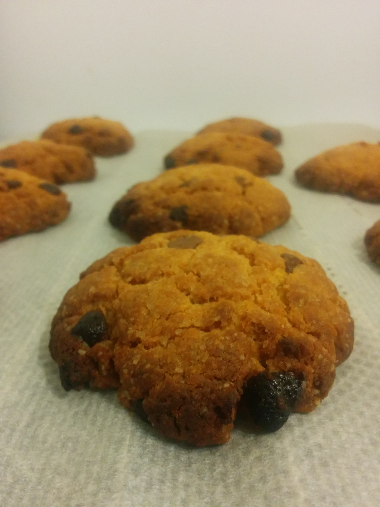

# American cookie

## Ingredients

- 250 of flour
- 90 g of brown cane sugar
- 1 sachet of vanilla sugar
- 1 pinch of salt
- 1/2 sachet of baking powder
- 1 egg
- 125 g of unsalted butter
- 2 teaspoons of honey
- (milk) chocolate chips

## Steps

- Preheat the oven to 220°C (thermostat 7-8), with the rack at the lowest position.
- Mix the flour, the sugars, the salt and the baking powder in a large bowl
- Melt the butter and add the beaten egg and the 2 teaspoons of honey, then stir everything into the mixture
- Add the chocolate chips, mix
- Shape cookies about 10cm in diameter
- Bake for 9 to 11 minutes
