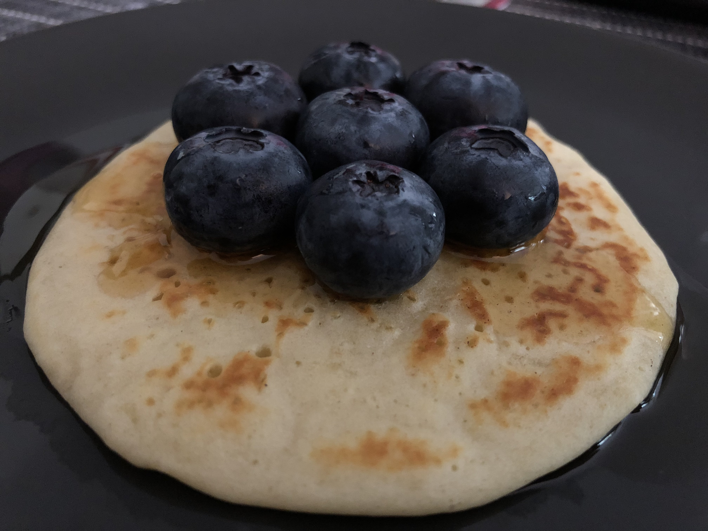

# Pancakes

[From Mes envies culinaires](https://www.mesinspirationsculinaires.com/article-recette-pancakes-de-cyril-lignac.html)

## Ingredients

- 2 eggs
- 50 g salted butter
- 350 ml milk
- 300 g flour
- 50 g caster sugar
- 2 sachets of baking powder

## Instructions

1. In a bowl, pour in the flour, the baking powder and the sugar.
1. Cut the butter into pieces and melt it in the slightly warmed milk.
1. Pour the milk into the batter, add the lightly beaten eggs and mix everything until you get a batter close to crêpe batter but slightly thicker.
1. Let it rest for 30 minutes at room temperature.
1. Heat a large crêpe pan or other pan and brush it with oil (I used a pancake plate to get pancakes of a regular size); otherwise use a ladle and pour small mounds of batter (3 or 4, all depending on the size of your pan).
1. Cook for a few minutes; as soon as bubbles appear on the surface of the pancakes, gently flip them with the help of a spatula. Continue cooking for about 2 minutes.
1. Serve the pancakes right away or keep them.
1. Drizzle with maple syrup, honey or spread with chocolate spread, jam etc... garnish if desired with fruit.

## Old recipe

### Ingredients
For 2 people (12 pancakes)

- 150g of flour
- 1 heaping teaspoon of baking powder
- 1 sachet of vanilla sugar
- 1 tablespoon of butter
- 200ml of milk
- 1 whole egg
- 1 tablespoon of white sugar

### Steps

- Whisk the eggs with the sugar,
- Add the butter,
- Mix the flour and the baking powder, then fold it in
- Gradually add the milk,
- Let the batter rest for at least 30 min
- Cook the pancakes for 2min on each side
