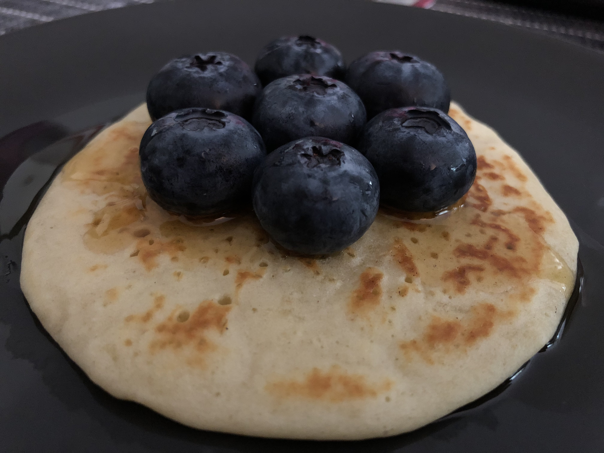

# Pancakes

[From Mes envies culinaires](https://www.mesinspirationsculinaires.com/article-recette-pancakes-de-cyril-lignac.html)

## Ingrédients

- 2 oeufs
- 50 g beurre demi-sel
- 350 ml lait
- 300 g farine
- 50 g sucre en poudre
- 2 sachets de levure chimique

## Instructions

1. Dans un saladier, verser la farine, la levure et le sucre.
1. Couper le beurre en parcelle et le faire fondre dans le lait légèrement tiédit.
1. Verser le lait dans la pâte, ajouter les oeufs légèrement battus et mélanger le tout jusqu’à obtenir une pâte qui se rapproche à la pâte à crêpe légèrement plus épaisse.
1. Laisser reposer 30 minutes à température ambiante.
1. Chauffer une grande poêle à crêpe ou autre poêle et la badigeonner d'huile (j'ai utilisé une plaque à pancake afin d'avoir des pancakes de taille régulière) sinon utiliser une louche et verser des petits tas de pâte (3 ou 4 tout dépendra de la grandeur de votre poêle).
1. Laisser cuire quelques minutes, des que des bulles apparaissent sur la surface des pancakes les retourner délicatement en vous aidant d'une spatule. continuer la cuisson pendant 2 minutes environ.
1. Servir les pancakes aussitôt ou les conserver.
1. Arroser de sirop d’érable, de miel ou napper de pâte à tartiner confiture etc... garnir si désiré de fruits.

## Ancienne recette

### Ingrédients
Pour 2 personnes (12 pancakes)

- 150g de farine
- 1 cuillière à café bombée de levure chimique
- 1 sachet de sucre vanillé
- 1 cuillière à soupe de beurre
- 200ml de lait
- 1 oeuf entier
- 1 cuillière à soupe de sucre blanc

### Etapes

- Battre, au fouet, les oeufs avec le sucre, 
- Ajouter le beurre,
- Mélanger la farine et la levure, puis l'incorporer
- Ajouter progressivement le lait, 
- Laisser reposer la pâte pendant au moins 30 min
- Faire cuire les pancakes 2min sur chaque face
