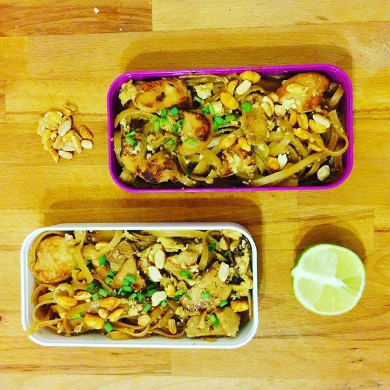

# Pad Thai

## Ingredients

For 4 people

- 285g of rice vermicelli
- 12cl of soy sauce
- 2 tablespoons of olive oil
- 350g of thinly sliced chicken breast
- 180g of firm tofu cut into strips
- 3 cloves of garlic, chopped
- 3 eggs
- 3 to 4 spring onions, chopped
- 100g of roasted peanuts
- 150g of bean sprouts
- 1 lime cut into wedges

## Steps

- Soak the rice noodles in hot water for 20 minutes
- In a ramekin, mix the soy sauce, the brown sugar and the oil
- Fry the chicken and tofu pieces in a wok over medium-high heat
- Add the garlic and the contents of the ramekin. Cook for 2 min then add the noodles
- Cook until the noodles are tender
- Push the noodles to the side, crack the three eggs into the cleared space and stir the eggs until they become firm
- Mix everything together
- Serve on a plate, topping with the roasted peanuts, the bean sprouts and the lime wedge
